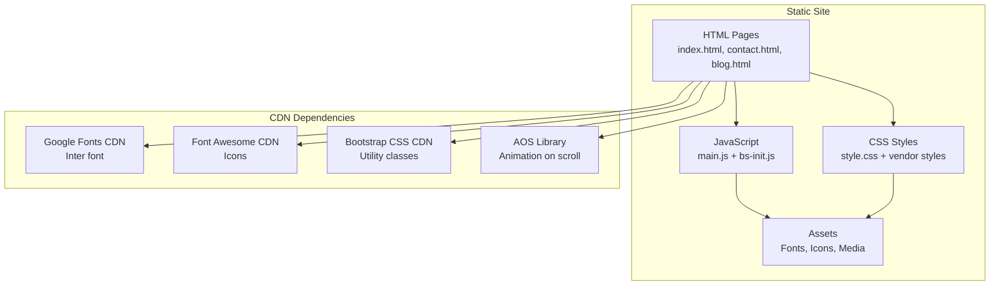
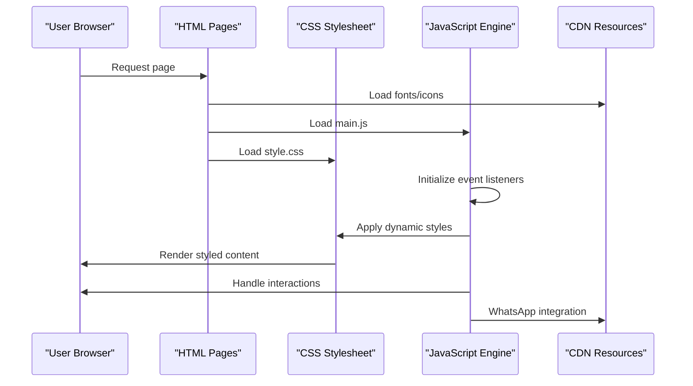
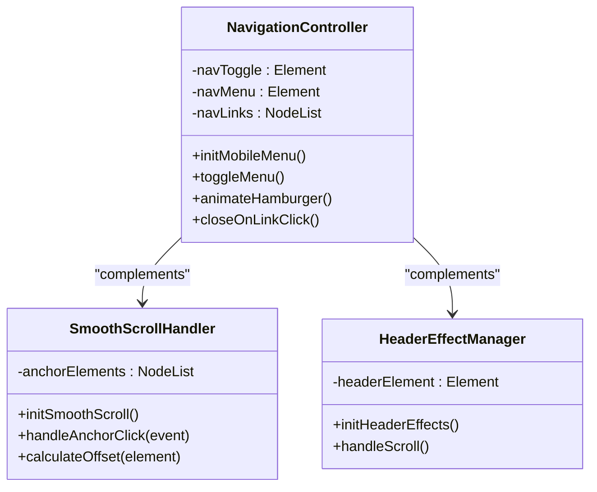
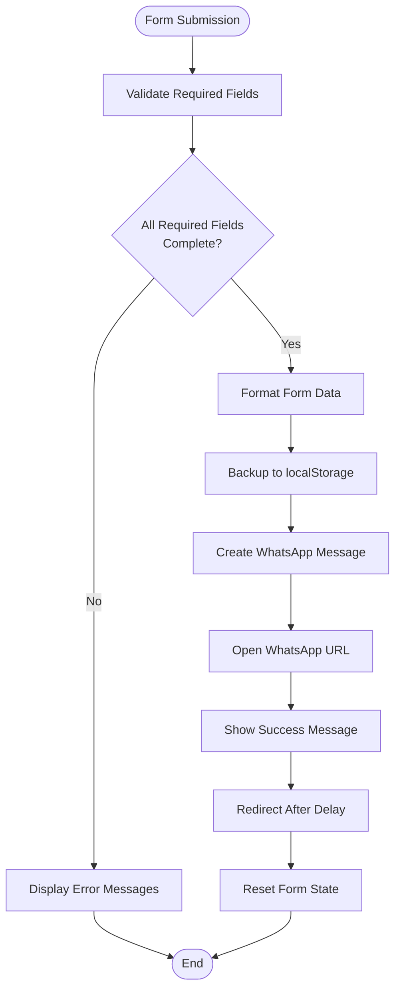
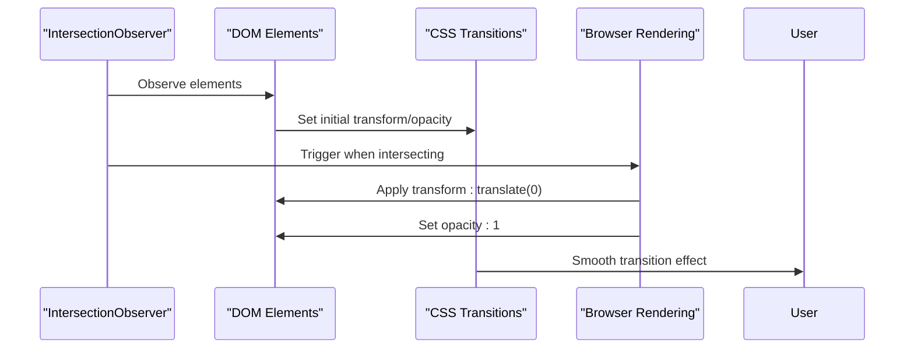
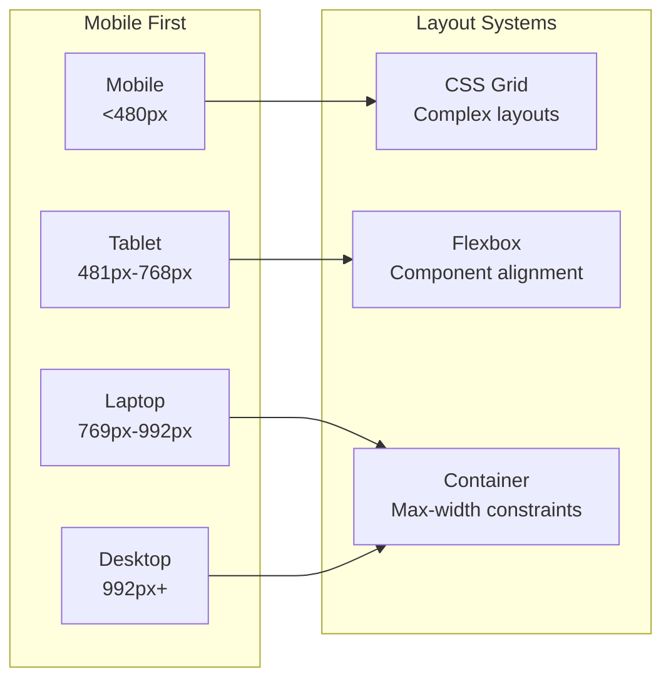
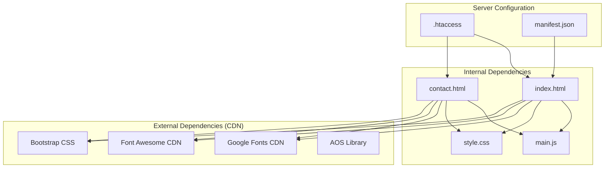

# Technical Implementation

<cite>
**Referenced Files in This Document**
- [main.js](file://js/main.js)
- [style.css](file://css/style.css)
- [index.html](file://index.html)
- [contact.html](file://contact.html)
- [blog.html](file://blog.html)
- [bs-init.js](file://assets/js/bs-init.js)
- [bootstrap.min.css](file://assets/bootstrap/css/bootstrap.min.css)
- [aos.min.css](file://assets/css/aos.min.css)
- [.htaccess](file://.htaccess)
- [manifest.json](file://manifest.json)
- [README.md](file://README.md)
</cite>

## Table of Contents
1. [Introduction](#introduction)
2. [Project Structure](#project-structure)
3. [Core Components](#core-components)
4. [Architecture Overview](#architecture-overview)
5. [Detailed Component Analysis](#detailed-component-analysis)
6. [Dependency Analysis](#dependency-analysis)
7. [Performance Considerations](#performance-considerations)
8. [Troubleshooting Guide](#troubleshooting-guide)
9. [Conclusion](#conclusion)

## Introduction
This document provides a comprehensive technical analysis of the graduates website implementation. It focuses on the JavaScript ES6 architecture in main.js, covering DOM manipulation, event handling, animation systems using the Intersection Observer API, and form processing logic. It also documents the CSS architecture with custom properties, responsive design principles using CSS Grid and Flexbox, and animation effects. Asset management strategies, font loading, and CDN integrations are explained with practical examples. The document includes performance optimization techniques, browser compatibility handling, accessibility features, and code organization patterns.

## Project Structure
The website follows a minimal, static architecture with clear separation of concerns:
- HTML pages define semantic structure and content
- CSS handles presentation, responsive layouts, and animations
- JavaScript provides interactive behaviors and dynamic functionality
- Assets are served via CDN for performance and reliability
- Build-time optimizations include compression and caching headers

**Diagram sources**
- [index.html](file://index.html)
- [contact.html](file://contact.html)
- [style.css](file://css/style.css)
- [main.js](file://js/main.js)
- [bs-init.js](file://assets/js/bs-init.js)
- [bootstrap.min.css](file://assets/bootstrap/css/bootstrap.min.css)
- [aos.min.css](file://assets/css/aos.min.css)

**Section sources**
- [README.md](file://README.md)
- [index.html](file://index.html)
- [contact.html](file://contact.html)
- [blog.html](file://blog.html)

## Core Components
This section examines the primary technical components and their implementation patterns.

### JavaScript ES6 Implementation (main.js)
The main.js file implements modular, ES6-compliant JavaScript with clear separation of concerns:

#### Navigation System
- Mobile hamburger menu toggle with animated hamburger icon
- Dynamic menu state management
- Automatic menu closure on link selection

#### Smooth Scrolling
- Anchor link smooth scroll with configurable offset
- Dynamic positioning calculations
- Prevent default anchor behavior

#### Header Effects
- Dynamic shadow changes based on scroll position
- Performance-optimized scroll handler

#### Phone Number Formatting
- Real-time Brazilian phone number formatting
- Input sanitization and validation
- Cursor position preservation

#### Form Processing (Disabled)
- Comprehensive form validation logic (commented)
- WhatsApp integration preparation
- LocalStorage backup functionality
- Loading state management

#### Scroll Animations
- Intersection Observer API implementation
- Fade-in animations with translate transitions
- Configurable thresholds and margins

#### Active Navigation Tracking
- Real-time active link highlighting
- Section-based navigation state
- Scroll position monitoring

#### Form Validation
- Email pattern validation
- Custom validity messages
- Visual feedback styling

#### Utility Functions
- Loading state toggling
- Form reset handling
- Error boundary implementation

**Section sources**
- [main.js](file://js/main.js)

### CSS Architecture and Design System
The stylesheet implements a modern, maintainable design system:

#### Custom Properties (CSS Variables)
- Centralized color palette management
- Typography scale variables
- Spacing and shadow definitions
- Transition timing controls

#### Responsive Design Principles
- Mobile-first approach with progressive enhancement
- Flexible grid layouts using CSS Grid and Flexbox
- Breakpoint-free responsive patterns
- Fluid typography scaling

#### Layout Systems
- CSS Grid for complex page layouts
- Flexbox for component alignment
- Container-based max-width constraints
- Responsive image handling

#### Animation Framework
- CSS transitions for interactive states
- Transform-based animations
- Opacity fade-ins for scroll-triggered effects
- Performance-optimized transform properties

#### Component-Based Styling
- Modular class naming conventions
- Reusable utility classes
- Theme-consistent color application
- Shadow and border radius standardization

**Section sources**
- [style.css](file://css/style.css)

### Asset Management and CDN Integration
The site leverages CDN-hosted resources for optimal performance:

#### Font Loading Strategy
- Google Fonts Inter font family
- Display swap for fast rendering
- Fallback system for degraded connections

#### Icon System
- Font Awesome CDN integration
- SVG-based icon delivery
- Performance-optimized icon loading

#### Vendor Libraries
- Bootstrap CSS for utility classes
- AOS library for scroll animations
- Lazy-loading of non-critical resources

#### Asset Optimization
- CDN caching benefits
- Reduced bandwidth usage
- Global availability and reliability

**Section sources**
- [index.html](file://index.html)
- [contact.html](file://contact.html)
- [blog.html](file://blog.html)

## Architecture Overview
The website employs a client-side architecture optimized for performance and user experience:

**Diagram sources**
- [index.html](file://index.html)
- [contact.html](file://contact.html)
- [style.css](file://css/style.css)
- [main.js](file://js/main.js)

### Control Flow Patterns
The application follows predictable control flow patterns:
- DOMContentLoaded triggers initialization
- Event delegation for dynamic content
- Intersection Observer for lazy loading
- Promise-based async operations
- Error boundaries for graceful degradation

**Section sources**
- [main.js](file://js/main.js)
- [style.css](file://css/style.css)

## Detailed Component Analysis

### Navigation System Analysis
The navigation system demonstrates robust DOM manipulation and event handling:

**Diagram sources**
- [main.js](file://js/main.js)

#### Mobile Navigation Implementation
- Hamburger menu with three animated spans
- Transform-based rotation animations
- Dynamic opacity changes for middle span
- Automatic state restoration on navigation

#### Smooth Scrolling Mechanics
- Offset calculation for fixed headers
- Dynamic element positioning
- Behavior: 'smooth' for modern browsers
- Graceful fallback for unsupported browsers

**Section sources**
- [main.js](file://js/main.js)
- [index.html](file://index.html)

### Form Processing and Validation System
The form system implements comprehensive client-side validation and processing:

**Diagram sources**
- [main.js](file://js/main.js)
- [contact.html](file://contact.html)

#### Phone Number Formatting Logic
- Real-time input sanitization
- Brazilian phone number pattern matching
- Dynamic formatting based on digit count
- Cursor position preservation during formatting

#### Email Validation System
- Regex-based email pattern matching
- Real-time validation feedback
- Custom validity messages
- Visual styling for invalid states

#### WhatsApp Integration
- Structured message formatting
- Timestamp inclusion
- Multi-line message composition
- URL encoding for special characters

**Section sources**
- [main.js](file://js/main.js)
- [contact.html](file://contact.html)

### Animation System Architecture
The animation system utilizes modern web APIs for smooth, performant animations:

**Diagram sources**
- [main.js](file://js/main.js)
- [style.css](file://css/style.css)

#### Intersection Observer Implementation
- Configurable threshold (0.1) for early triggering
- Root margin adjustment (-50px) for entrance timing
- Fade-in with translate Y transition
- Performance-optimized callback handling

#### CSS Animation Framework
- Transition properties for smooth effects
- Transform3D acceleration hints
- Hardware-accelerated animations
- Consistent timing functions

**Section sources**
- [main.js](file://js/main.js)
- [style.css](file://css/style.css)

### Responsive Design Implementation
The responsive design system ensures optimal viewing across all devices:

**Diagram sources**
- [style.css](file://css/style.css)
- [index.html](file://index.html)

#### Breakpoint-Free Responsive Patterns
- Flexible grid layouts with minmax()
- Auto-fit and auto-fill grid tracks
- Fluid typography scaling
- Aspect-ratio preserving containers

#### Component Responsiveness
- Mobile navigation with hamburger menu
- Stacked layouts on small screens
- Touch-friendly interactive elements
- Adaptive spacing and sizing

**Section sources**
- [style.css](file://css/style.css)
- [index.html](file://index.html)

## Dependency Analysis
The website maintains minimal external dependencies while leveraging CDN-hosted resources:

**Diagram sources**
- [main.js](file://js/main.js)
- [style.css](file://css/style.css)
- [index.html](file://index.html)
- [contact.html](file://contact.html)
- [.htaccess](file://.htaccess)
- [manifest.json](file://manifest.json)

### CDN Integration Strategy
- Google Fonts for typography
- Font Awesome for icons
- Bootstrap for utility classes
- AOS for scroll animations

### Server-Side Optimizations
- GZIP compression for text assets
- Long-term caching for static resources
- Security headers for protection
- HTTPS enforcement

**Section sources**
- [index.html](file://index.html)
- [contact.html](file://contact.html)
- [.htaccess](file://.htaccess)

## Performance Considerations
The website implements several performance optimization techniques:

### Loading Performance
- CDN-hosted resources reduce latency
- GZIP compression reduces payload size
- Long-term caching minimizes repeated downloads
- Font-display: swap for faster text rendering

### Runtime Performance
- Intersection Observer for efficient scroll handling
- CSS transforms for hardware-accelerated animations
- Event delegation for reduced memory footprint
- Debounced scroll handlers prevent excessive recalculations

### Bundle Size Optimization
- Single main.js file with modular functions
- Minimal external dependencies
- Inline critical CSS for above-the-fold content
- Lazy loading of non-critical resources

### Accessibility and Compatibility
- Semantic HTML structure
- ARIA labels for screen readers
- Graceful degradation for older browsers
- Mobile-first responsive design

## Troubleshooting Guide
Common issues and their solutions:

### JavaScript Issues
- **Event listeners not firing**: Verify DOMContentLoaded wrapper
- **Intersection Observer not working**: Check browser support and polyfill
- **Smooth scroll not functioning**: Ensure anchor elements exist and have proper href attributes

### CSS Issues
- **Responsive layout breaking**: Verify container max-width and grid properties
- **Animation not triggering**: Check Intersection Observer configuration and element visibility
- **Mobile navigation not working**: Ensure hamburger menu elements exist and event listeners are attached

### Performance Issues
- **Slow page load**: Audit CDN resource loading and compression headers
- **Poor scroll performance**: Monitor for layout thrashing and optimize transform properties
- **Memory leaks**: Verify event listener cleanup and observer unobserve calls

### Cross-Browser Compatibility
- **Older browser support**: Implement polyfills for missing APIs (Promise, fetch, IntersectionObserver)
- **CSS Grid issues**: Provide fallback layouts for unsupported browsers
- **JavaScript compatibility**: Use Babel transpilation for ES6+ features

**Section sources**
- [main.js](file://js/main.js)
- [style.css](file://css/style.css)
- [.htaccess](file://.htaccess)

## Conclusion
The graduates website demonstrates a well-architected, performance-optimized implementation that balances modern web standards with practical functionality. The JavaScript ES6 implementation showcases clean separation of concerns, efficient DOM manipulation, and robust event handling. The CSS architecture provides a scalable foundation with custom properties, responsive design patterns, and animation systems. The strategic use of CDN resources ensures optimal performance while maintaining simplicity. The code organization follows maintainable patterns with clear module boundaries and comprehensive error handling. This implementation serves as an excellent example of modern, client-side web development focused on user experience and performance.