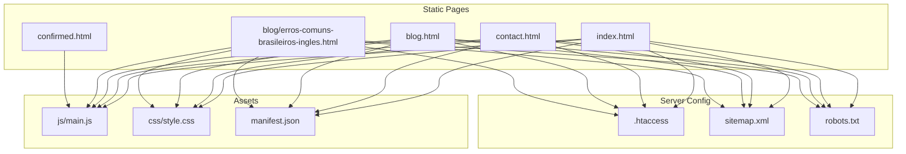
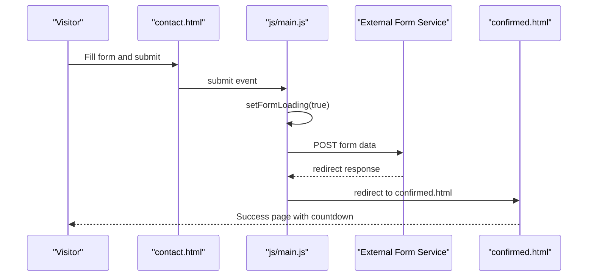
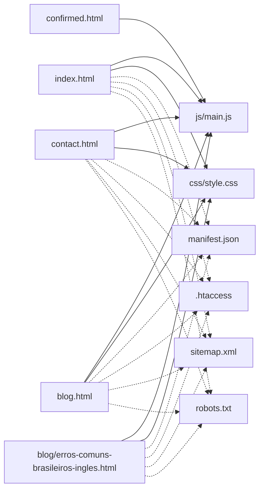

# Troubleshooting and Maintenance

<cite>
**Referenced Files in This Document**
- [index.html](file://index.html)
- [contact.html](file://contact.html)
- [blog.html](file://blog.html)
- [blog/erros-comuns-brasileiros-ingles.html](file://blog/erros-comuns-brasileiros-ingles.html)
- [confirmed.html](file://confirmed.html)
- [js/main.js](file://js/main.js)
- [css/style.css](file://css/style.css)
- [.htaccess](file://.htaccess)
- [manifest.json](file://manifest.json)
- [sitemap.xml](file://sitemap.xml)
- [robots.txt](file://robots.txt)
- [README.md](file://README.md)
</cite>

## Table of Contents
1. [Introduction](#introduction)
2. [Project Structure](#project-structure)
3. [Core Components](#core-components)
4. [Architecture Overview](#architecture-overview)
5. [Detailed Component Analysis](#detailed-component-analysis)
6. [Dependency Analysis](#dependency-analysis)
7. [Performance Considerations](#performance-considerations)
8. [Troubleshooting Guide](#troubleshooting-guide)
9. [Maintenance Procedures](#maintenance-procedures)
10. [Conclusion](#conclusion)

## Introduction
This section provides a comprehensive troubleshooting and maintenance guide for the graduates website. It focuses on diagnosing and resolving common issues such as browser compatibility problems, form submission failures, navigation errors, and mobile responsiveness issues. It also covers systematic debugging techniques (console, network inspection, performance profiling), error resolution strategies for JavaScript execution errors, CSS rendering issues, and HTML validation problems. Practical examples demonstrate form validation troubleshooting, WhatsApp integration debugging, and animation system issues. Finally, it outlines maintenance procedures, preventive strategies, backups, disaster recovery, and ongoing monitoring and security patching.

## Project Structure
The website is a static, single-page application with a landing page, a dedicated contact page, a blog hub, and several article pages. JavaScript handles interactive behaviors (navigation, smooth scrolling, phone formatting, form loading states, scroll animations, and global error logging). CSS defines responsive layouts and visual themes. Server configuration enforces compression, caching, security headers, and HTTPS redirection.

**Diagram sources**
- [index.html](file://index.html)
- [contact.html](file://contact.html)
- [blog.html](file://blog.html)
- [blog/erros-comuns-brasileiros-ingles.html](file://blog/erros-comuns-brasileiros-ingles.html)
- [confirmed.html](file://confirmed.html)
- [js/main.js](file://js/main.js)
- [css/style.css](file://css/style.css)
- [.htaccess](file://.htaccess)
- [sitemap.xml](file://sitemap.xml)
- [robots.txt](file://robots.txt)

**Section sources**
- [README.md](file://README.md)
- [index.html](file://index.html)
- [contact.html](file://contact.html)
- [blog.html](file://blog.html)
- [blog/erros-comuns-brasileiros-ingles.html](file://blog/erros-comuns-brasileiros-ingles.html)
- [confirmed.html](file://confirmed.html)
- [js/main.js](file://js/main.js)
- [css/style.css](file://css/style.css)
- [.htaccess](file://.htaccess)
- [sitemap.xml](file://sitemap.xml)
- [robots.txt](file://robots.txt)

## Core Components
- Navigation and Smooth Scrolling: Mobile hamburger menu toggle, smooth scroll to sections, active link highlighting on scroll.
- Phone Number Formatting: Real-time formatting for Brazilian phone numbers.
- Form Handling: Client-side validation, loading states, and a commented-out local backup flow. The deployed form integrates with an external service and redirects to a success page.
- WhatsApp Integration: Floating buttons and links that open the native WhatsApp application with prefilled messages.
- Scroll Animations: Fade-in effects triggered when elements enter the viewport.
- Global Error Logging: Centralized error handler for uncaught exceptions.
- Responsive Design: CSS Grid/Flexbox layouts and media-aware breakpoints.
- Security and Performance: Compression, caching, security headers, and HTTPS enforcement via .htaccess.

**Section sources**
- [js/main.js](file://js/main.js)
- [css/style.css](file://css/style.css)
- [.htaccess](file://.htaccess)
- [README.md](file://README.md)

## Architecture Overview
The site relies on client-side logic and static assets. The contact form posts to an external service endpoint and then redirects to a success page. WhatsApp links integrate with the native app. The service worker registration is present but disabled by default.

**Diagram sources**
- [contact.html](file://contact.html)
- [js/main.js](file://js/main.js)
- [confirmed.html](file://confirmed.html)

**Section sources**
- [contact.html](file://contact.html)
- [js/main.js](file://js/main.js)
- [confirmed.html](file://confirmed.html)

## Detailed Component Analysis

### Navigation and Smooth Scroll
Common issues:
- Mobile menu not toggling or hamburger icon not animating.
- Smooth scroll not working or jumping to incorrect positions.
- Active navigation highlighting not updating.

Debugging steps:
- Open DevTools and inspect the navigation toggle and menu classes.
- Verify smooth scroll logic calculates offsets correctly and respects fixed header height.
- Confirm active link detection runs on scroll and matches section IDs.

Resolution strategies:
- Ensure DOMContentLoaded fires before binding events.
- Validate CSS sticky header does not interfere with scroll calculations.
- Check for conflicting styles that prevent visibility or pointer events.

**Section sources**
- [js/main.js](file://js/main.js)
- [css/style.css](file://css/style.css)

### Phone Number Formatting
Common issues:
- Input formatting not applied or truncates digits unexpectedly.
- Cursor jumps during typing.

Debugging steps:
- Inspect the input event handlers and the formatting function.
- Verify numeric-only sanitization and length limits.
- Test edge cases: paste, delete, backspace, and rapid typing.

Resolution strategies:
- Normalize input value before formatting.
- Preserve caret position during transformations.
- Limit input length to national format boundaries.

**Section sources**
- [js/main.js](file://js/main.js)

### Form Validation and Submission
Common issues:
- Validation not triggered or incorrectly flags valid inputs.
- Submission appears stuck or fails silently.
- Redirect to success page not happening.

Debugging steps:
- Check email regex validity and custom validity messages.
- Verify loading state toggles and button disabling.
- Confirm external service endpoint and redirect configuration.
- Review console logs for errors and network failures.

Resolution strategies:
- Fix regex pattern and ensure field presence checks.
- Implement explicit error messaging and visual feedback.
- Validate form action and hidden fields (access key, subject, redirect).
- Ensure history replace prevents duplicate submissions.

**Section sources**
- [contact.html](file://contact.html)
- [js/main.js](file://js/main.js)
- [confirmed.html](file://confirmed.html)

### WhatsApp Integration
Common issues:
- WhatsApp links fail to open the native app.
- Prefilled message missing or malformed.
- Floating button not clickable.

Debugging steps:
- Validate wa.me URLs and encoded message parameters.
- Test opening links in multiple browsers and devices.
- Inspect analytics/logging hooks for tracking initiation.

Resolution strategies:
- Ensure proper URL encoding and character limits.
- Provide fallback links to web.whatsapp.com when native app unavailable.
- Confirm floating button accessibility attributes and z-index stacking.

**Section sources**
- [index.html](file://index.html)
- [contact.html](file://contact.html)
- [js/main.js](file://js/main.js)

### Scroll Animations
Common issues:
- Elements do not animate or animate inconsistently.
- Animation triggers too early or too late.

Debugging steps:
- Inspect IntersectionObserver thresholds and margins.
- Verify initial opacity/transform states and transitions.
- Check for overlapping observers or element visibility.

Resolution strategies:
- Adjust threshold and rootMargin for viewport sensitivity.
- Ensure initial states reset before observing.
- Optimize transition durations for performance.

**Section sources**
- [js/main.js](file://js/main.js)
- [css/style.css](file://css/style.css)

### CSS Rendering Issues
Common issues:
- Layout shifts, misaligned grids, or collapsed elements.
- Typography not rendering or fonts not loading.
- Hover/focus states not applying.

Debugging steps:
- Inspect computed styles and overridden properties.
- Validate CSS Grid/Flexbox declarations and container constraints.
- Check font loading and fallback stacks.

Resolution strategies:
- Normalize base styles and enforce box-sizing.
- Use CSS custom properties for consistent theming.
- Provide font-display strategies and fallback fonts.

**Section sources**
- [css/style.css](file://css/style.css)

### HTML Validation Problems
Common issues:
- Missing alt attributes, invalid meta tags, or unclosed elements.
- Accessibility violations (missing labels, ARIA roles).

Debugging steps:
- Run validator tools against pages and confirm warnings.
- Audit semantic markup and ARIA usage.
- Verify meta descriptions and Open Graph tags.

Resolution strategies:
- Add descriptive alt text for images.
- Correct meta tag placement and content.
- Improve ARIA labeling and keyboard navigation.

**Section sources**
- [index.html](file://index.html)
- [contact.html](file://contact.html)
- [blog.html](file://blog.html)
- [blog/erros-comuns-brasileiros-ingles.html](file://blog/erros-comuns-brasileiros-ingles.html)
- [README.md](file://README.md)

## Dependency Analysis
- Client-side dependencies: None. Uses CDN-hosted Font Awesome and Google Fonts.
- Server-side dependencies: Apache modules for compression, caching, headers, and HTTPS redirection.
- Asset dependencies: CSS and JS files linked from HTML pages; PWA manifest referenced from home page.

**Diagram sources**
- [index.html](file://index.html)
- [contact.html](file://contact.html)
- [blog.html](file://blog.html)
- [blog/erros-comuns-brasileiros-ingles.html](file://blog/erros-comuns-brasileiros-ingles.html)
- [confirmed.html](file://confirmed.html)
- [js/main.js](file://js/main.js)
- [css/style.css](file://css/style.css)
- [manifest.json](file://manifest.json)
- [.htaccess](file://.htaccess)
- [sitemap.xml](file://sitemap.xml)
- [robots.txt](file://robots.txt)

**Section sources**
- [index.html](file://index.html)
- [contact.html](file://contact.html)
- [blog.html](file://blog.html)
- [blog/erros-comuns-brasileiros-ingles.html](file://blog/erros-comuns-brasileiros-ingles.html)
- [confirmed.html](file://confirmed.html)
- [js/main.js](file://js/main.js)
- [css/style.css](file://css/style.css)
- [manifest.json](file://manifest.json)
- [.htaccess](file://.htaccess)
- [sitemap.xml](file://sitemap.xml)
- [robots.txt](file://robots.txt)

## Performance Considerations
- Compression: GZIP compression reduces payload sizes for HTML, CSS, JS, and JSON.
- Caching: Long-lived cache headers for static assets improve load times.
- Security headers: Mitigations for MIME sniffing, framing, XSS, referrer policy, and permissions reduce risk.
- HTTPS enforcement: Redirects HTTP to HTTPS ensuring secure transport.
- Minimized dependencies: Using CDNs avoids bundling overhead.
- CSS and JS efficiency: Avoid heavy animations on low-power devices; optimize transitions.

Recommendations:
- Monitor Core Web Vitals and Lighthouse scores regularly.
- Audit Largest Contentful Paint (LCP) and First Input Delay (FID).
- Lazy-load non-critical resources if adding media.
- Keep assets minimal and up-to-date.

**Section sources**
- [.htaccess](file://.htaccess)
- [README.md](file://README.md)

## Troubleshooting Guide

### Browser Compatibility Problems
Symptoms:
- JavaScript features not supported (e.g., IntersectionObserver, CSS Grid).
- Polyfills missing causing layout or script failures.

Steps:
- Verify browser support for modern APIs.
- Add polyfills or feature detection with graceful degradation.
- Test on latest Chrome, Firefox, Safari, Edge, and mobile browsers.

Resolution:
- Use feature-detection and provide fallbacks for unsupported APIs.
- Keep CSS Grid/Flexbox usage consistent and validated.

**Section sources**
- [README.md](file://README.md)
- [css/style.css](file://css/style.css)
- [js/main.js](file://js/main.js)

### Form Submission Failures
Symptoms:
- Form submits but no redirect or success message.
- Network errors or CORS issues.
- Duplicate submissions after redirect.

Steps:
- Inspect Network tab for POST requests and responses.
- Check console for JavaScript errors.
- Validate external service endpoint and hidden fields.

Resolution:
- Confirm form action and redirect configuration.
- Implement history.replaceState to prevent resubmission.
- Add explicit error handling and user feedback.

**Section sources**
- [contact.html](file://contact.html)
- [js/main.js](file://js/main.js)
- [confirmed.html](file://confirmed.html)

### Navigation Errors
Symptoms:
- Smooth scroll jumps or anchors do not align with header.
- Active link highlighting not updating.

Steps:
- Measure header height and adjust scroll offset.
- Verify section IDs match anchor targets.
- Check for dynamic content affecting heights.

Resolution:
- Recalculate offsets dynamically and account for sticky header.
- Debounce scroll handlers for performance.

**Section sources**
- [js/main.js](file://js/main.js)

### Mobile Responsiveness Issues
Symptoms:
- Hamburger menu not visible or not functioning.
- Text too small or buttons hard to tap.
- Grids collapse unexpectedly.

Steps:
- Inspect media queries and breakpoint logic.
- Validate touch targets and spacing.
- Test on various viewport widths.

Resolution:
- Ensure nav-toggle displays on smaller screens.
- Increase touch target sizes and spacing.
- Use flexible units and min/max constraints.

**Section sources**
- [css/style.css](file://css/style.css)
- [index.html](file://index.html)
- [contact.html](file://contact.html)
- [blog.html](file://blog.html)

### Console Debugging
Common issues:
- Uncaught exceptions not visible.
- Performance bottlenecks in scripts.

Steps:
- Use console.error and global error handler.
- Profile long tasks and render-blocking calls.
- Inspect call stack for failing functions.

Resolution:
- Add centralized error logging and optional reporting.
- Optimize loops, DOM queries, and event listeners.

**Section sources**
- [js/main.js](file://js/main.js)

### Network Inspection
Common issues:
- Slow asset loads or blocked resources.
- Mixed content warnings.

Steps:
- Check Network panel for failed requests.
- Verify HTTPS and mixed content policies.
- Review caching headers and compression.

Resolution:
- Serve all assets over HTTPS.
- Confirm cache headers and compression are applied.

**Section sources**
- [.htaccess](file://.htaccess)

### Performance Profiling
Common issues:
- Jank during scroll or animations.
- Long load times on mobile networks.

Steps:
- Use Performance panel to record interactions.
- Identify long tasks and layout thrashing.
- Measure First Contentful Paint and Total Blocking Time.

Resolution:
- Reduce work in scroll handlers.
- Optimize CSS transitions and avoid forced synchronous layouts.

**Section sources**
- [js/main.js](file://js/main.js)
- [css/style.css](file://css/style.css)

### Error Resolution Strategies
- JavaScript Execution Errors:
  - Use try/catch around risky operations.
  - Centralize error handling and logging.
  - Provide user-friendly error messages.

- CSS Rendering Issues:
  - Normalize base styles and check specificity wars.
  - Validate Grid/Flexbox constraints.
  - Ensure transitions are hardware-accelerated when possible.

- HTML Validation Problems:
  - Run validators and fix missing attributes.
  - Improve semantics and accessibility.
  - Verify meta tags and structured data.

**Section sources**
- [js/main.js](file://js/main.js)
- [css/style.css](file://css/style.css)
- [index.html](file://index.html)
- [contact.html](file://contact.html)
- [blog.html](file://blog.html)
- [blog/erros-comuns-brasileiros-ingles.html](file://blog/erros-comuns-brasileiros-ingles.html)

### Practical Examples

#### Form Validation Troubleshooting
- Symptom: Email field marked invalid despite correct format.
- Steps: Inspect regex, custom validity, and blur event.
- Resolution: Align regex with accepted patterns and clear validity on correction.

**Section sources**
- [js/main.js](file://js/main.js)

#### WhatsApp Integration Debugging
- Symptom: Link opens web.whatsapp.com instead of native app.
- Steps: Verify wa.me URL and encoding; test on device with app installed.
- Resolution: Ensure correct scheme and encoded message; add analytics hook.

**Section sources**
- [index.html](file://index.html)
- [contact.html](file://contact.html)
- [js/main.js](file://js/main.js)

#### Animation System Issues
- Symptom: Cards fade in too early or not at all.
- Steps: Adjust IntersectionObserver threshold and root margin.
- Resolution: Fine-tune trigger conditions and initial element states.

**Section sources**
- [js/main.js](file://js/main.js)
- [css/style.css](file://css/style.css)

## Maintenance Procedures

### Content Updates
- Replace placeholder testimonials and blog content with real, approved text.
- Update pricing, availability, and contact details consistently across pages.
- Validate canonical tags and meta descriptions for SEO.

**Section sources**
- [README.md](file://README.md)
- [index.html](file://index.html)
- [blog.html](file://blog.html)
- [blog/erros-comuns-brasileiros-ingles.html](file://blog/erros-comuns-brasileiros-ingles.html)

### Asset Management
- Keep CSS and JS minified and cached appropriately.
- Validate CDN links and fallbacks.
- Rotate favicons and PWA icons as needed.

**Section sources**
- [.htaccess](file://.htaccess)
- [manifest.json](file://manifest.json)

### Performance Monitoring
- Track Core Web Vitals monthly.
- Audit Lighthouse reports and address regressions.
- Monitor server response times and error rates.

**Section sources**
- [.htaccess](file://.htaccess)
- [README.md](file://README.md)

### Security Updates
- Apply .htaccess security headers regularly.
- Ensure HTTPS enforcement remains active.
- Review robots.txt and sitemap.xml for correctness.

**Section sources**
- [.htaccess](file://.htaccess)
- [robots.txt](file://robots.txt)
- [sitemap.xml](file://sitemap.xml)

### Preventive Maintenance
- Back up HTML/CSS/JS and configuration files regularly.
- Version control all changes and review pull requests.
- Plan for disaster recovery: keep a clean copy of assets and server config.

**Section sources**
- [.gitignore](file://.gitignore)
- [README.md](file://README.md)

### Backup and Disaster Recovery
- Maintain local copies of all HTML, CSS, JS, and server configs.
- Store PWA manifest and favicon assets separately.
- Document deployment steps and rollback procedures.

**Section sources**
- [README.md](file://README.md)
- [manifest.json](file://manifest.json)

### Monitoring Website Health
- Use browser devtools to monitor runtime errors and performance.
- Set up basic server logs and alerts for 5xx errors.
- Track traffic via analytics if added; otherwise rely on server metrics.

**Section sources**
- [js/main.js](file://js/main.js)
- [.htaccess](file://.htaccess)

## Conclusion
This guide consolidates practical troubleshooting and maintenance strategies tailored to the graduates website. By following systematic debugging approaches, validating HTML/CSS/JavaScript, and maintaining robust server configurations, you can ensure reliable performance, seamless user experiences, and efficient operations across devices and browsers.